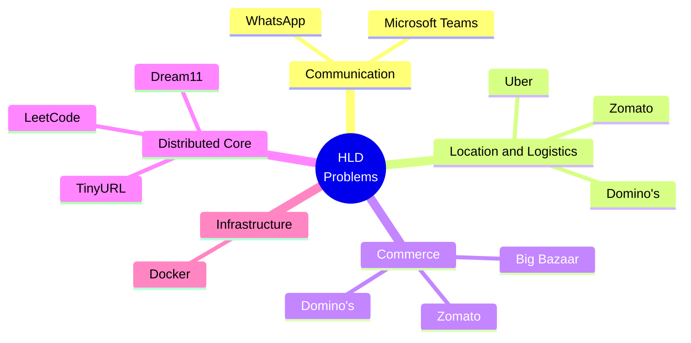
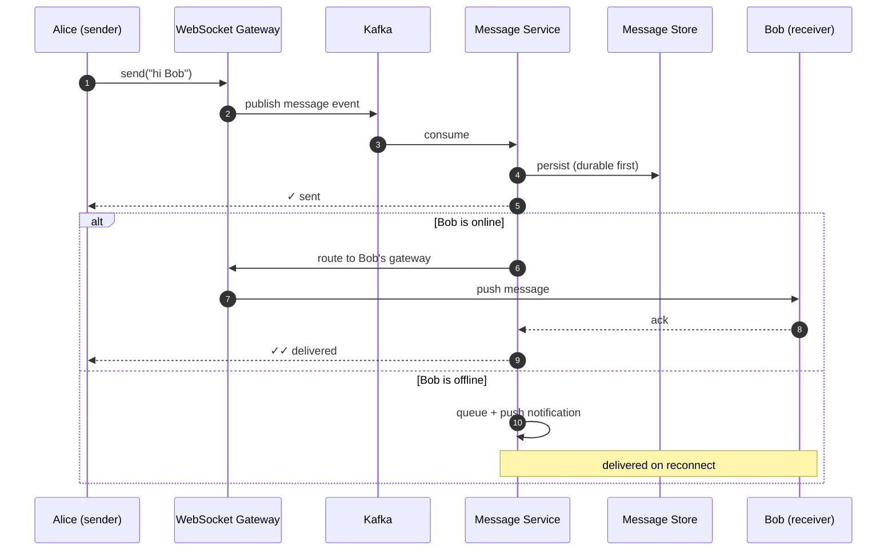
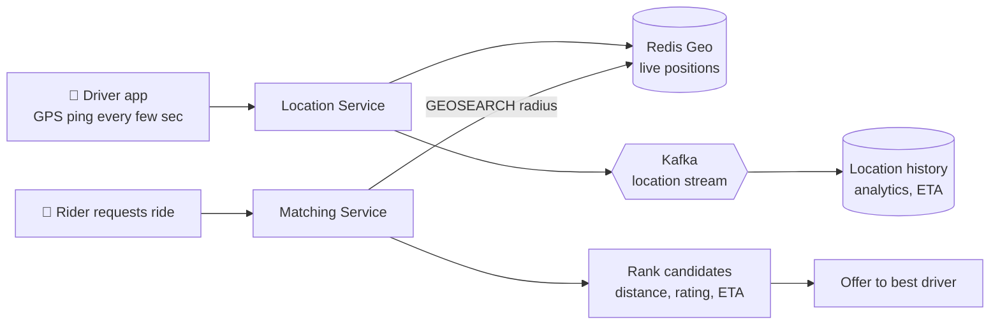
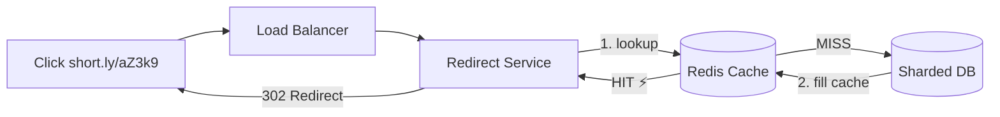
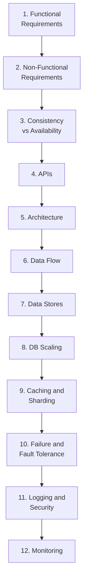
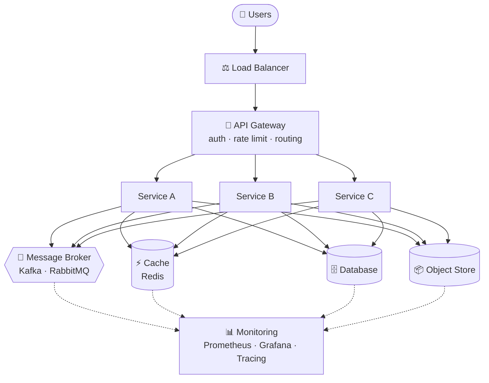
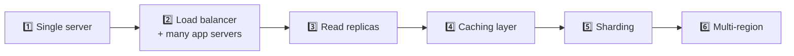
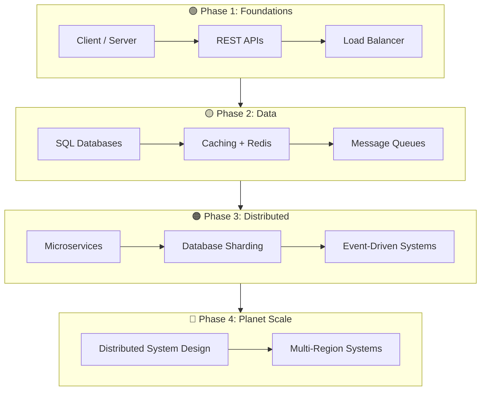

<!-- ============================================================ -->
<!--                    IMPORTANT HLD PROBLEMS                    -->
<!-- ============================================================ -->

<div align="center">


<a href="https://git.io/typing-svg">
  
</a>

<br/>


<br/>

**[🧭 Roadmap](#-the-big-picture)** &nbsp;•&nbsp;
**[📚 The 10 Systems](#-the-10-systems)** &nbsp;•&nbsp;
**[🔬 Sneak Peeks](#-sneak-peeks-three-flows-in-60-seconds)** &nbsp;•&nbsp;
**[🧠 Framework](#-the-10-step-hld-framework)** &nbsp;•&nbsp;
**[📏 Cheat Sheet](#-back-of-the-envelope-cheat-sheet)** &nbsp;•&nbsp;
**[🤝 Contribute](#-contribute)**

</div>

---

## 💥 The Premise

> Most system design resources hand you a finished diagram and say *"memorize this."*
>
> **This repo does the opposite.** It starts with a product, a pile of requirements, and a scary traffic number, then walks through **every decision** that leads to the architecture, including what breaks and how it's repaired.

```text
 REAL PRODUCT ─► REQUIREMENTS ─► SCALE ─► BOTTLENECKS ─► TRADE-OFFS ─► ARCHITECTURE
                                                                            │
                          PRODUCTION-READY ◄─ MONITOR ◄─ SECURE ◄─ SURVIVE FAILURE
```

**The architecture is never the starting point. The requirements are.**

<table>
<tr>
<td align="center" width="25%"><h3>10</h3>Production-style<br/>HLD problems</td>
<td align="center" width="25%"><h3>12</h3>Engineering lenses<br/>applied to each</td>
<td align="center" width="25%"><h3>10</h3>Steps in the<br/>reusable framework</td>
<td align="center" width="25%"><h3>1</h3>Mindset:<br/><i>why, not what</i></td>
</tr>
</table>

---

## 🧭 The Big Picture



---

## 📚 The 10 Systems !

| # | System | The Hard Problem | Spotlight Concepts | Folder |
|:-:|:--|:--|:--|:--|
| 01 | 💬 **WhatsApp** | Reliable, ordered delivery to *millions* of live connections | WebSockets · Kafka · Presence · Delivery receipts | [`/WhatsApp`](./WhatsApp) |
| 02 | 🚕 **Uber** | Find and match the nearest driver while everyone is moving | Geospatial indexing · Redis Geo · Matching · Surge pricing | [`/Uber`](./Uber) |
| 03 | 🔗 **TinyURL** | Tiny IDs, enormous read traffic | Hashing · Cache-aside · Sharding · Analytics | [`/TinyURL`](./TinyURL) |
| 04 | 🏏 **Dream11** | Traffic explodes the moment a match goes live | Leaderboards · Live scoring · Wallets · Concurrency | [`/Dream11`](./Dream11) |
| 05 | 🧑‍💻 **LeetCode** | Running *untrusted* code safely at scale | Sandboxing · Job queues · Worker fleets | [`/LeetCode`](./LeetCode) |
| 06 | 💼 **Microsoft Teams** | Chat + presence + meetings + files in one platform | WebSockets · Notifications · Event-driven | [`/Microsoft-Teams`](./Microsoft-Teams) |
| 07 | 🍕 **Domino's** | Customer → kitchen → payment → doorstep, end to end | Cart · Payments · Delivery assignment · Tracking | [`/Dominos`](./Dominos) |
| 08 | 🛒 **Big Bazaar** | Festival-sale traffic without overselling inventory | Inventory · Order saga · Sharding · Caching | [`/Big-Bazaar`](./Big-Bazaar) |
| 09 | 🍔 **Zomato** | Location search + transactions + live tracking in one flow | Geo queries · Redis · Kafka · WebSockets | [`/Zomato`](./Zomato) |
| 10 | 🐳 **Docker** | Package, isolate, ship and orchestrate workloads | Image layers · Registry · Networking · Orchestration | [`/Docker`](./Docker) |

<details>
<summary><b>🔎 Which technologies show up in which design?</b> (click to expand)</summary>

<br/>

| Concept | WhatsApp | Uber | TinyURL | Dream11 | LeetCode | Teams | Domino's | Big Bazaar | Zomato | Docker |
|:--|:-:|:-:|:-:|:-:|:-:|:-:|:-:|:-:|:-:|:-:|
| **WebSockets / real-time** | ✅ | ✅ | | ✅ | | ✅ | ✅ | | ✅ | |
| **Kafka / events** | ✅ | ✅ | | ✅ | | ✅ | | | ✅ | |
| **Redis / caching** | | ✅ | ✅ | ✅ | | | | ✅ | ✅ | ✅ |
| **Geospatial** | | ✅ | | | | | | | ✅ | |
| **Sharding / partitioning** | | | ✅ | | | | | ✅ | | |
| **Queues & workers** | | | | | ✅ | | | | | |
| **Payments** | | ✅ | | ✅ | | | ✅ | ✅ | ✅ | |
| **Sandboxing / isolation** | | | | | ✅ | | | | | ✅ |

</details>

---

## 🔬 Sneak Peeks: Three Flows in 60 Seconds

A taste of the *style* of reasoning used across every design.

### 💬 WhatsApp: one message, end to end



**Decision to notice:** persist *before* acknowledging, so a crash never silently drops a message.

### 🚕 Uber : finding the nearest driver



**Decision to notice:** hot, ever-changing location data lives in memory; history streams off to cheaper storage.

### 🔗 TinyURL: why it is a cache problem, not a database problem



**Decision to notice:** reads vastly outnumber writes, so the cache absorbs the traffic and the database only handles misses.

---

## 🏗️ Anatomy of Every HLD

Every system is dissected through the **same 12 lenses**, so you build a repeatable muscle, not 10 disconnected memories.



---

## 🧩 The Universal Building Blocks

Almost every large system is a remix of the same few components:



---

## ⚖️ Consistency vs Availability: Pick Per Data, Not Per System

```text
 STRONG CONSISTENCY  ◄──────────────────────────────────────►  EVENTUAL CONSISTENCY
 "Never be wrong"                                               "Never be down"

 💳 Payments    📦 Orders    🏷️ Inventory    ↩️ Refunds        📍 Location   🔔 Notifications
                                                                 📈 Analytics  🔍 Search index
                                                                 ⭐ Recommendations
```

> ❌ *"Always choose consistency."*
> ✅ ***"Choose the right consistency model for each piece of data."***

---

## 🚀 The Scaling Journey

Scale in response to **real bottlenecks**, never to impress anyone.



---

## 🧠 The 10-Step HLD Framework

Use this on *any* new problem. Tap a step to expand.

<details>
<summary><b>Step 1 — Clarify requirements</b></summary>

```text
What does the system need to do?
Who are the users?
What are the critical workflows?
```
</details>

<details>
<summary><b>Step 2 — Estimate scale</b></summary>

```text
Users · Requests/sec · Storage · Read/Write ratio · Peak traffic · Data growth
```
</details>

<details>
<summary><b>Step 3 — Define APIs</b></summary>

Identify the major operations before drawing a single box.
</details>

<details>
<summary><b>Step 4 — Identify core services</b></summary>

Split the system into logical domains with clear ownership.
</details>

<details>
<summary><b>Step 5 — Choose databases</b></summary>

```text
Transactional?  Read-heavy?  Highly dynamic?  Location-based?  Huge scale?
```
</details>

<details>
<summary><b>Step 6 — Add caching</b></summary>

Find the hot data and keep it close.
</details>

<details>
<summary><b>Step 7 — Add async processing</b></summary>

Move non-critical and long-running work to queues and events.
</details>

<details>
<summary><b>Step 8 — Scale</b></summary>

Replicas · Sharding · Partitioning · Load balancing · Horizontal scaling
</details>

<details>
<summary><b>Step 9 — Handle failures</b></summary>

```text
What if the database fails?   What if a service fails?   What if the network fails?
What if payment fails?        What if the queue fails?   What if a region goes down?
```
</details>

<details>
<summary><b>Step 10 — Secure and monitor</b></summary>

```text
Security + Logging + Metrics + Tracing + Alerts
```
</details>

---

## 📏 Back-of-the-Envelope Cheat Sheet

Rough numbers to keep your estimates honest. They are orders of magnitude, not benchmarks.

| Quick Conversion | Value |
|:--|:--|
| Seconds in a day | ~86,400 (≈ 10⁵) |
| **1 million requests/day** | **≈ 12 requests/sec** |
| 100 million requests/day | ≈ 1,200 requests/sec |
| Peak traffic multiplier | Often 2–10× the average (more for live events and sales) |

| Operation | Approx. Latency |
|:--|:--|
| Read from memory | ~100 ns |
| Read from SSD | ~100 µs |
| Round trip inside a datacenter | ~0.5 ms |
| Disk seek (spinning disk) | ~10 ms |
| Cross-continent round trip | ~100–150 ms |

> 💡 **Rule of thumb:** memory is orders of magnitude faster than disk, and the network is orders of magnitude slower than both. Most architecture choices come from that gap.

---

## 🛡️ Reliability, Security & Observability Toolkit

<table>
<tr>
<td valign="top" width="33%">

**🔁 Reliability**
- Retries + exponential backoff
- Circuit breakers
- Health checks
- Failover
- Graceful degradation
- Redundancy
- Multi-region
- Dead-letter queues

</td>
<td valign="top" width="33%">

**🔐 Security**
- HTTPS / TLS
- OAuth 2.0 · JWT · MFA
- RBAC
- Encryption
- Rate limiting
- Audit logs
- Secure payments
- Image scanning

</td>
<td valign="top" width="33%">

**📊 Observability**
- Centralized logging (ELK)
- Metrics (Prometheus)
- Dashboards (Grafana)
- OpenTelemetry
- Distributed tracing
- Alerting

</td>
</tr>
</table>

<details>
<summary><b>🧰 Full technology reference</b></summary>

<br/>

| Category | Technologies & Concepts |
|:--|:--|
| **Architecture** | Microservices · SOA · Event-driven · Client-server · API Gateway · Load Balancers · Service Discovery |
| **Databases** | PostgreSQL · MySQL · MongoDB · DynamoDB · Read replicas · Replication · Partitioning · Sharding |
| **Caching** | Redis · Memcached · Cache-aside · TTL · Invalidation · Hot-data caching |
| **Messaging** | Kafka · RabbitMQ · Pub/Sub · Async processing · Retry queues · DLQs |
| **Real-time** | WebSockets · Server-Sent Events · Presence · GPS tracking · Push notifications |
| **Scaling** | Horizontal · Vertical · Sharding · Replication · Auto scaling · Load balancing |

</details>

---

## 🎯 Interview Readiness Checklist

Before calling any HLD "done," can you answer all of these out loud?

- [ ] What are the **functional** requirements?
- [ ] What are the **non-functional** requirements?
- [ ] What is the **expected scale**?
- [ ] What are the **critical APIs**?
- [ ] What are the **core services**, and *why microservices*?
- [ ] *Why this database?* SQL vs NoSQL?
- [ ] **Where** does caching belong?
- [ ] How does the database **scale**, and where does **sharding** happen?
- [ ] Where is **async processing** the right call?
- [ ] How are **failures** handled? How is data **replicated**?
- [ ] How is it **secured**? How is it **monitored**?
- [ ] What happens in a **traffic spike**? What if a **region fails**?
- [ ] What are the **biggest trade-offs** you chose, and what did you give up?

---

## 🗺️ Recommended Learning Path



**Suggested problem order:** `TinyURL` → `WhatsApp` → `Zomato` → `Uber` → `Big Bazaar` → `Dream11` → `LeetCode` → `Teams` → `Domino's` → `Docker`

---

## 🛠️ Repository Structure

```text
Important-HLD-Problems/
│
├── 💬 WhatsApp/         → whatsapp.md        + whatsapp-hld.png
├── 🚕 Uber/             → uber.md            + uber-hld.png
├── 🔗 TinyURL/          → tiny-url.md        + tiny-url-hld.png
├── 🏏 Dream11/          → dream11.md         + dream11-hld.png
├── 🧑‍💻 LeetCode/        → leetcode.md        + leetcode-hld.png
├── 💼 Microsoft-Teams/  → microsoft-teams.md + ms-teams-hld.png
├── 🍕 Dominos/          → dominos.md         + dominos-hld.png
├── 🛒 Big-Bazaar/       → big-bazaar.md      + big-bazaar-hld.png
├── 🍔 Zomato/           → zomato.md          + zomato-hld.png
├── 🐳 Docker/           → docker.md          + docker-hld.png
│
└── README.md
```

Every folder pairs a **written design** with a **visual architecture diagram** covering services, APIs, databases, caches, queues, external systems, data flow and failure handling.

---

## 🧪 Ask These Questions of Every Design

```text
Why this service?                    Why this database?
Why this cache?                      Why this consistency model?
Why sync here and async there?       What happens when it fails?
How does it go from 1K to 100M users?
```

> System design is not memorizing `Kafka · Redis · PostgreSQL · MongoDB · Kubernetes`.
> It's understanding **why they exist.**

---

## 🤝 Contribute

Contributions are very welcome. Better diagrams, sharper explanations, new failure scenarios, entirely new systems.

```bash
# 1. Fork the repo on GitHub, then clone your fork
git clone https://github.com/<your-username>/Important-HLD-Problems.git
cd Important-HLD-Problems

# 2. Create a branch
git checkout -b feature/<your-feature>

# 3. Make your changes, then commit
git add .
git commit -m "Improve Zomato HLD"

# 4. Push and open a Pull Request
git push origin feature/<your-feature>
```

In your PR, explain **what** changed, **why**, and **what problem it solves**. For major architectural changes, please **open an issue first** so we can discuss the design.

### 🗓️ Roadmap: Systems I'd Love to Explore Next

- [ ] 🎬 Netflix
- [ ] ▶️ YouTube
- [ ] 📸 Instagram
- [ ] 🎵 Spotify
- [ ] 📦 Amazon
- [ ] 🛍️ Flipkart
- [ ] ☁️ Google Drive
- [ ] 📁 Dropbox
- [ ] 💬 Slack
- [ ] 💼 LinkedIn
- [ ] 🐦 Twitter / X
- [ ] 🛵 Swiggy
- [ ] 💸 Razorpay
- [ ] 📲 Paytm
- [ ] 🗺️ Google Maps
- [ ] 🏠 Airbnb
- [ ] 🏏 Cricbuzz
- [ ] 🎟️ Ticket Booking System
- [ ] 🗃️ Distributed File System
- [ ] 🔔 Notification System

**Want one of these (or something else) next?** [Open an issue](../../issues) and vote with a 👍.

### 🐛 Found a Flaw? Good.

Maybe a scaling decision needs debate, a database choice isn't optimal, a failure scenario is missing, or a flow needs another diagram. Open an issue and let's discuss it.

> System design rarely has one "perfect" answer. It's about **requirements → constraints → trade-offs → architecture.**

---

## 👨‍💻 About the Author

<table>
<tr>
<td>

### Manu Bharadwaj

Software Engineer who enjoys turning complex systems into simple, understandable engineering concepts.

💻 Software Engineering &nbsp;•&nbsp; 🏗️ System Design &nbsp;•&nbsp; 🌐 Distributed Systems
☁️ Cloud Architecture &nbsp;•&nbsp; 🚀 Scalable Backends &nbsp;•&nbsp; 🧠 Problem Solving

</td>
</tr>
</table>

<div align="center">

<a href="https://www.linkedin.com/in/manu-bharadwaj-3507a345/">
  
</a>
<a href="https://www.youtube.com/@code-with-Bharadwaj">
  
</a>

**🎥 More system design and engineering content on [Code with Bharadwaj](https://www.youtube.com/@code-with-Bharadwaj)**

</div>

---

## ⭐ Support the Project

| | |
|:--|:--|
| ⭐ **Star** | Helps the repo reach more engineers preparing for interviews |
| 🍴 **Fork** | Use these designs as the starting point for your own prep |
| 💬 **Discuss** | Share improvements and alternative architectures |
| 🤝 **Contribute** | Help make it better for everyone learning system design |

<div align="center">

<a href="https://star-history.com/#<your-username>/Important-HLD-Problems&Date">
  /Important-HLD-Problems&type=Date" alt="Star History Chart" width="600" />
</a>

<br/><br/>

> ***"Great systems aren't built by adding more technology.***
> ***They're built by making the right engineering decisions."***

### 🚀 Keep Designing. Keep Learning. Keep Building.

Made with ❤️ by **Manu Bharadwaj** &nbsp;•&nbsp; **Happy System Designing! 🏗️**


</div>
